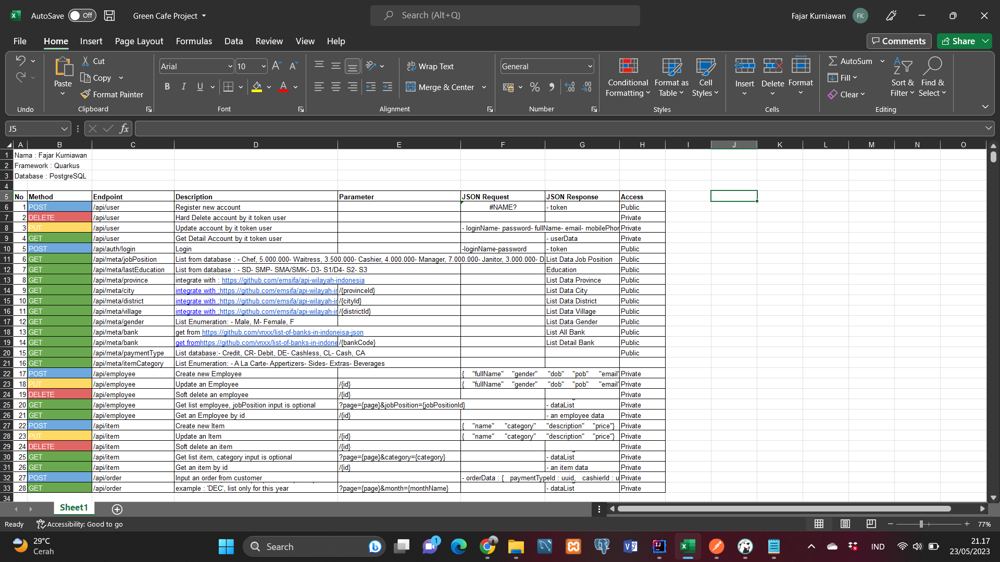
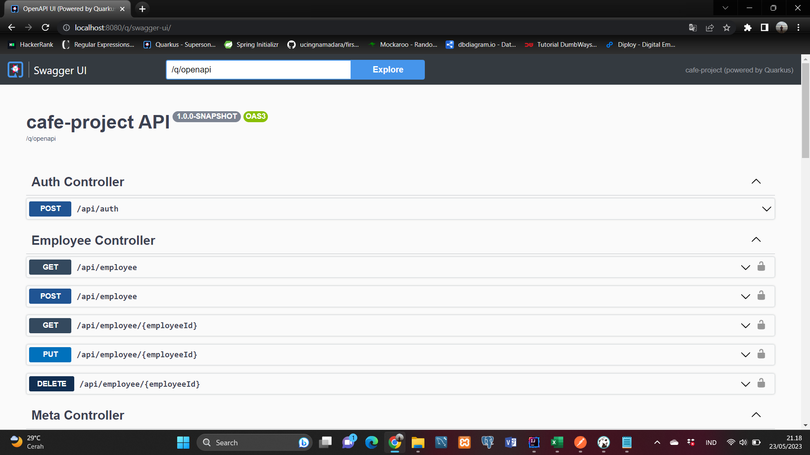
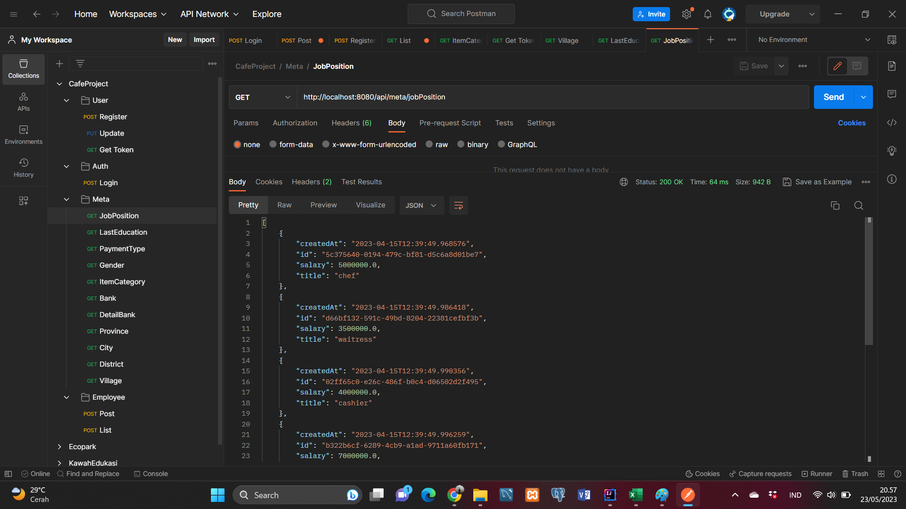
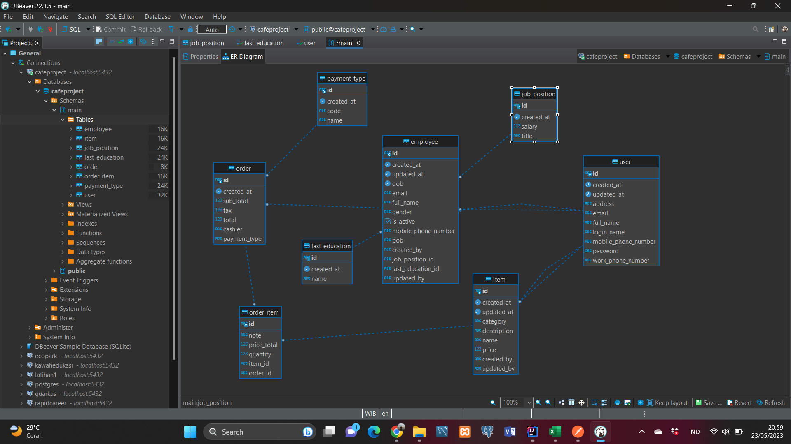

# cafe-project

This project uses Quarkus, the Supersonic Subatomic Java Framework.

If you want to learn more about Quarkus, please visit its website: https://quarkus.io/ .

## Running the application in dev mode

You can run your application in dev mode that enables live coding using:
```shell script
./mvn quarkus:dev 
```

    
Swagger UI


Postman


Database PostgreSQL


